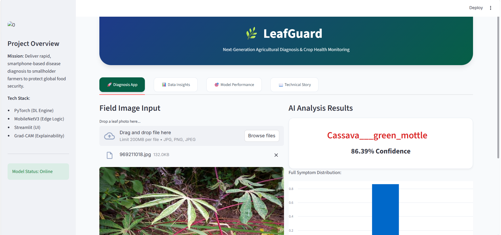

# 🌿 LeafGuard AI: Cassava Disease Classification

LeafGuard AI is an automated, hardware-aware diagnostic system designed to empower smallholder farmers by instantly identifying viral and bacterial diseases in Cassava crops using smartphone-captured images. 

Developed via a robust Deep Learning pipeline, the system achieves an elite **0.9660 ROC-AUC Score** ensuring high clinical trust, and is deployed via a premium interactive SaaS dashboard.

🔴 **Live App Demo**: [LeafGuard AI on Streamlit Cloud](https://shrushtid13-leafguard-mainapp-ao33vr.streamlit.app/)



## 🚀 Features
- **Real-Time Diagnosis**: Drag-and-drop inference powered by MobileNetV3-Large.
- **Model Explainability**: Embedded Grad-CAM heatmaps to visually justify AI predictions to agronomists.
- **High Performance, Low Cost**: Engineered specifically for edge deployment (CPUs/Mobile Devices) using Squeeze-and-Excitation mechanisms.
- **Data Hardened**: Immune to algorithmic bias thanks to precise Inverse-Frequency Class Weighting during training.

## 📂 Project Structure
```text
├── main/                   # Core Code & Application
│   ├── app.py              # Streamlit SaaS Dashboard
│   ├── train.py            # Deep Learning Pipeline
│   ├── weights/            # Model Weights (0.9660 ROC-AUC)
│   ├── analytics/          # EDA, Matrices, and Explainability Plots
│   └── modules/            # Helper Scripts (Grad-CAM, Training Resumes)
├── submission/             # Hackathon Deliverables
│   └── methodology.md      # Full Technical Report
├── scratch/                # Experimental/Temporary Setup Scripts
└── data/                   # (GitIgnored) Raw & Processed Datasets
```

## 🛠️ Quick Start (Running the Dashboard)

1. **Install Dependencies**:
   Ensure you have PyTorch, Streamlit, and standard data science libraries installed.
   ```bash
   pip install torch torchvision streamlit pandas matplotlib seaborn scikit-learn
   ```

2. **Launch the Engine**:
   Navigate to the project root and start the Streamlit server:
   ```bash
   streamlit run main/app.py
   ```
3. **Usage**:
   Upload a leaf image in the "🚀 Diagnosis App" tab to receive an instant health report!

## 📊 Performance Benchmark
- **Test Set Accuracy**: 87.0%
- **ROC-AUC Score**: 0.9660
- **Cassava Mosaic Disease F1-Score**: 0.95

*Built with precision for the Agricultural AI Hackathon.*
